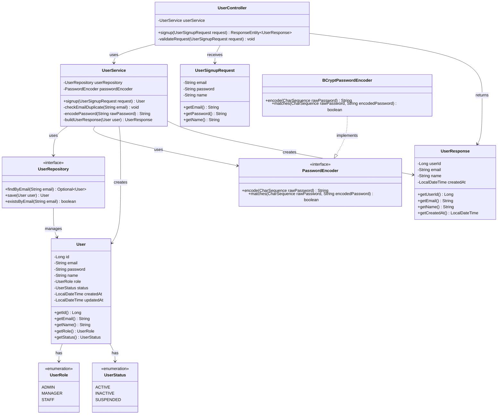

# User 회원가입 기능 클래스 구조 설계

## 개요

본 문서는 ReAcademix Backend의 회원가입 기능(`POST /api/v1/users`)을 구현하기 위한 클래스 구조 설계입니다.

**설계 원칙:**
- 계층형 아키텍처 (Layered Architecture)
- 관심사 분리 (Separation of Concerns)
- 의존성 역전 원칙 (Dependency Inversion Principle)

---

## 클래스 다이어그램



---

## 레이어별 클래스 상세

### 1. Controller Layer

#### UserController
**책임**: HTTP 요청/응답 처리, 요청 검증, DTO 변환

**주요 메서드:**
- `signup(UserSignupRequest request): ResponseEntity<UserResponse>`
  - 회원가입 요청 처리
  - 요청 데이터 검증
  - Service 호출 및 응답 변환
  - HTTP 상태 코드 관리 (201 Created, 400 Bad Request 등)

**의존성:**
- `UserService` (의존성 주입)

---

### 2. Service Layer

#### UserService
**책임**: 비즈니스 로직 처리, 트랜잭션 관리

**주요 메서드:**
- `signup(UserSignupRequest request): User`
  - 회원가입 비즈니스 로직 실행
  - 이메일 중복 검사
  - 비밀번호 암호화
  - User 엔티티 생성 및 저장
  - 예외 처리

- `checkEmailDuplicate(String email): void`
  - 이메일 중복 검사
  - 중복 시 `AUTH_001` 예외 발생

- `encodePassword(String rawPassword): String`
  - 평문 비밀번호를 bcrypt로 암호화

- `buildUserResponse(User user): UserResponse`
  - User 엔티티를 UserResponse DTO로 변환

**의존성:**
- `UserRepository` (의존성 주입)
- `PasswordEncoder` (의존성 주입, Spring Security)

---

### 3. Repository Layer

#### UserRepository
**책임**: 데이터베이스 접근, JPA 쿼리 실행

**주요 메서드:**
- `findByEmail(String email): Optional<User>`
  - 이메일로 사용자 조회
  - 이메일 중복 검사에 사용

- `save(User user): User`
  - 사용자 저장 (INSERT 또는 UPDATE)

- `existsByEmail(String email): boolean`
  - 이메일 존재 여부 확인 (성능 최적화용)

**인터페이스:**
- Spring Data JPA `JpaRepository<User, Long>` 상속

---

### 4. Entity Layer

#### User
**책임**: 데이터베이스 테이블 매핑, 도메인 모델

**주요 필드:**
- `id: Long` (PK, AUTO_INCREMENT)
- `email: String` (UNIQUE, NOT NULL)
- `password: String` (NOT NULL, bcrypt 해시)
- `name: String` (NOT NULL)
- `role: UserRole` (NOT NULL, DEFAULT 'ADMIN')
- `status: UserStatus` (NOT NULL, DEFAULT 'ACTIVE')
- `createdAt: LocalDateTime` (자동 생성)
- `updatedAt: LocalDateTime` (자동 업데이트)

**JPA 어노테이션:**
- `@Entity`, `@Table`, `@Id`, `@GeneratedValue`, `@Column` 등

---

### 5. DTO Layer

#### UserSignupRequest
**책임**: 회원가입 요청 데이터 전달

**주요 필드:**
- `email: String` (필수, 이메일 형식)
- `password: String` (필수, 최소 8자)
- `name: String` (필수, 최소 2자)

**검증 어노테이션:**
- `@NotBlank`, `@Email`, `@Size`, `@Pattern` 등

#### UserResponse
**책임**: 회원가입 응답 데이터 전달

**주요 필드:**
- `userId: Long`
- `email: String`
- `name: String`
- `createdAt: LocalDateTime`

**주의사항:**
- 비밀번호 필드는 포함하지 않음 (보안)

---

### 6. Utility Layer

#### PasswordEncoder (Spring Security Interface)
**책임**: 비밀번호 암호화 및 검증

**주요 메서드:**
- `encode(CharSequence rawPassword): String`
  - 평문 비밀번호를 암호화된 문자열로 변환

- `matches(CharSequence rawPassword, String encodedPassword): boolean`
  - 평문 비밀번호와 암호화된 비밀번호 비교

**구현체:**
- `BCryptPasswordEncoder` (Spring Security 제공)
  - bcrypt 알고리즘 사용
  - salt rounds: 10 이상 권장

---

### 7. Enum Layer

#### UserRole
**책임**: 사용자 역할 정의

**값:**
- `ADMIN`: 관리자 (MVP 기본값)
- `MANAGER`: 관리자 (확장)
- `STAFF`: 직원 (확장)

#### UserStatus
**책임**: 사용자 상태 정의

**값:**
- `ACTIVE`: 정상 사용 가능 (MVP 기본값)
- `INACTIVE`: 비활성화
- `SUSPENDED`: 일시 정지

---

## 의존성 흐름

```
HTTP Request
    ↓
UserController (요청 수신, 검증)
    ↓
UserService (비즈니스 로직)
    ↓
UserRepository (데이터 접근)
    ↓
Database (users 테이블)
```

**의존성 주입:**
- Controller → Service (생성자 주입 또는 필드 주입)
- Service → Repository (생성자 주입)
- Service → PasswordEncoder (생성자 주입, Spring Bean)

---

## 패키지 구조 제안

```
com.reacademix.reacademix_backend
├── controller
│   └── UserController.java
├── service
│   └── UserService.java
├── repository
│   └── UserRepository.java
├── entity
│   ├── User.java
│   ├── UserRole.java (enum)
│   └── UserStatus.java (enum)
├── dto
│   ├── request
│   │   └── UserSignupRequest.java
│   └── response
│       └── UserResponse.java
└── config
    └── SecurityConfig.java (PasswordEncoder Bean 설정)
```

---

## 주요 메서드 시그니처 요약

### UserController
```java
@PostMapping("/api/v1/users")
public ResponseEntity<UserResponse> signup(@Valid @RequestBody UserSignupRequest request)
```

### UserService
```java
public User signup(UserSignupRequest request)
private void checkEmailDuplicate(String email)
private String encodePassword(String rawPassword)
private UserResponse buildUserResponse(User user)
```

### UserRepository
```java
Optional<User> findByEmail(String email)
User save(User user)
boolean existsByEmail(String email)
```

---

**작성일**: 2025-01-27  
**버전**: 1.0  
**작성자**: Backend Development Team

