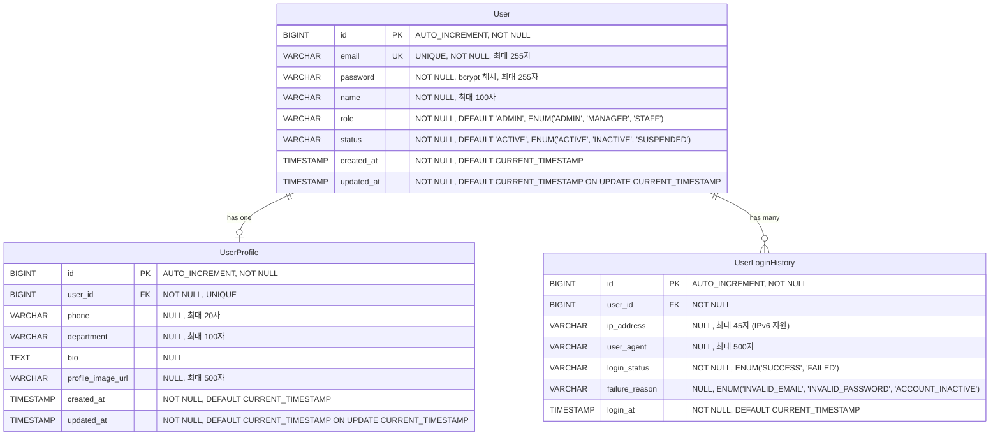

# User 데이터 모델 설계

## 개요

본 문서는 ReAcademix Backend의 User 관련 데이터 모델 설계입니다.
회원가입 API 스펙(`POST /api/v1/users`)을 기준으로 설계되었으며, 향후 확장 가능성을 고려하여 포함되었습니다.

**참조 문서:**
- API 명세서: `docs/api-spec-auth.md`
- SRS: REQ-FUNC-036 (사용자 인증)
- GitHub Issue: #1 - BE-AUTH-001

---

## 데이터 모델 설계 원칙

1. **MVP 범위**: 현재는 단일 관리자 역할만 지원하지만, 향후 확장을 고려하여 role, status 필드 포함
2. **보안**: 비밀번호는 bcrypt로 암호화하여 저장
3. **확장성**: UserProfile, UserLoginHistory 등 향후 필요한 테이블을 미리 설계
4. **성능**: 자주 조회되는 필드(email)에 인덱스 생성

---

## ERD (Entity Relationship Diagram)



---

## 테이블 상세 설계

### 1. users 테이블

**목적**: 시스템 사용자 기본 정보 저장

| 컬럼명 | 타입 | 제약조건 | 설명 |
|--------|------|----------|------|
| `id` | BIGINT | PK, AUTO_INCREMENT, NOT NULL | 사용자 고유 ID (Primary Key) |
| `email` | VARCHAR(255) | UNIQUE, NOT NULL | 사용자 이메일 주소 (로그인 ID, 중복 불가) |
| `password` | VARCHAR(255) | NOT NULL | 암호화된 비밀번호 (bcrypt 해시) |
| `name` | VARCHAR(100) | NOT NULL | 사용자 이름 (최소 2자, 최대 100자) |
| `role` | VARCHAR(20) | NOT NULL, DEFAULT 'ADMIN' | 사용자 역할<br/>- MVP: 'ADMIN'만 사용<br/>- 확장: 'MANAGER', 'STAFF' 등 추가 가능<br/>- ENUM 또는 VARCHAR 사용 |
| `status` | VARCHAR(20) | NOT NULL, DEFAULT 'ACTIVE' | 사용자 상태<br/>- 'ACTIVE': 정상 사용 가능<br/>- 'INACTIVE': 비활성화<br/>- 'SUSPENDED': 일시 정지<br/>- ENUM 또는 VARCHAR 사용 |
| `created_at` | TIMESTAMP | NOT NULL, DEFAULT CURRENT_TIMESTAMP | 계정 생성 시간 |
| `updated_at` | TIMESTAMP | NOT NULL, DEFAULT CURRENT_TIMESTAMP ON UPDATE CURRENT_TIMESTAMP | 계정 정보 수정 시간 |

**인덱스:**
- PRIMARY KEY: `id`
- UNIQUE INDEX: `email`
- INDEX: `status` (활성 사용자 조회 최적화)
- INDEX: `role` (역할별 사용자 조회 최적화)

**비즈니스 규칙:**
- 이메일은 대소문자 구분 없이 저장 (소문자로 정규화)
- 비밀번호는 평문 저장 금지 (bcrypt 암호화 필수)
- MVP에서는 role='ADMIN'만 사용, 모든 사용자 동일 권한

---

### 2. user_profiles 테이블 (선택적, 향후 확장)

**목적**: 사용자 추가 프로필 정보 저장 (1:1 관계)

| 컬럼명 | 타입 | 제약조건 | 설명 |
|--------|------|----------|------|
| `id` | BIGINT | PK, AUTO_INCREMENT, NOT NULL | 프로필 고유 ID |
| `user_id` | BIGINT | FK, NOT NULL, UNIQUE | users.id 참조 (1:1 관계) |
| `phone` | VARCHAR(20) | NULL | 전화번호 (선택적) |
| `department` | VARCHAR(100) | NULL | 소속 부서/팀 (선택적) |
| `bio` | TEXT | NULL | 자기소개 (선택적) |
| `profile_image_url` | VARCHAR(500) | NULL | 프로필 이미지 URL (선택적) |
| `created_at` | TIMESTAMP | NOT NULL, DEFAULT CURRENT_TIMESTAMP | 프로필 생성 시간 |
| `updated_at` | TIMESTAMP | NOT NULL, DEFAULT CURRENT_TIMESTAMP ON UPDATE CURRENT_TIMESTAMP | 프로필 수정 시간 |

**인덱스:**
- PRIMARY KEY: `id`
- UNIQUE INDEX: `user_id` (1:1 관계 보장)
- FOREIGN KEY: `user_id` REFERENCES `users(id)` ON DELETE CASCADE

**비즈니스 규칙:**
- User와 1:1 관계 (한 사용자당 하나의 프로필)
- MVP에서는 선택적 테이블 (필요 시 추가)

---

### 3. user_login_history 테이블 (선택적, 향후 확장)

**목적**: 사용자 로그인 이력 추적 (보안 및 모니터링)

| 컬럼명 | 타입 | 제약조건 | 설명 |
|--------|------|----------|------|
| `id` | BIGINT | PK, AUTO_INCREMENT, NOT NULL | 로그인 이력 고유 ID |
| `user_id` | BIGINT | FK, NOT NULL | users.id 참조 |
| `ip_address` | VARCHAR(45) | NULL | 로그인 시도 IP 주소 (IPv6 지원) |
| `user_agent` | VARCHAR(500) | NULL | 브라우저/클라이언트 정보 |
| `login_status` | VARCHAR(20) | NOT NULL | 로그인 결과<br/>- 'SUCCESS': 성공<br/>- 'FAILED': 실패 |
| `failure_reason` | VARCHAR(50) | NULL | 실패 사유 (login_status='FAILED'인 경우)<br/>- 'INVALID_EMAIL': 이메일 없음<br/>- 'INVALID_PASSWORD': 비밀번호 불일치<br/>- 'ACCOUNT_INACTIVE': 계정 비활성화 |
| `login_at` | TIMESTAMP | NOT NULL, DEFAULT CURRENT_TIMESTAMP | 로그인 시도 시간 |

**인덱스:**
- PRIMARY KEY: `id`
- INDEX: `user_id` (사용자별 로그인 이력 조회)
- INDEX: `login_at` (시간순 조회, 최근 로그인 조회)
- INDEX: `login_status` (실패 로그인 분석)
- FOREIGN KEY: `user_id` REFERENCES `users(id)` ON DELETE CASCADE

**비즈니스 규칙:**
- 모든 로그인 시도 기록 (성공/실패 모두)
- 보안 모니터링 및 무차별 대입 공격 감지에 활용
- MVP에서는 선택적 테이블 (필요 시 추가)

---

## 데이터 타입 및 제약조건 상세

### User 테이블

```sql
CREATE TABLE users (
    id BIGINT PRIMARY KEY AUTO_INCREMENT,
    email VARCHAR(255) NOT NULL UNIQUE,
    password VARCHAR(255) NOT NULL,  -- bcrypt 해시 (최대 60자, 여유를 위해 255자)
    name VARCHAR(100) NOT NULL,
    role VARCHAR(20) NOT NULL DEFAULT 'ADMIN',
    status VARCHAR(20) NOT NULL DEFAULT 'ACTIVE',
    created_at TIMESTAMP NOT NULL DEFAULT CURRENT_TIMESTAMP,
    updated_at TIMESTAMP NOT NULL DEFAULT CURRENT_TIMESTAMP ON UPDATE CURRENT_TIMESTAMP,
    
    INDEX idx_users_email (email),
    INDEX idx_users_status (status),
    INDEX idx_users_role (role)
);
```

### UserProfile 테이블 (선택적)

```sql
CREATE TABLE user_profiles (
    id BIGINT PRIMARY KEY AUTO_INCREMENT,
    user_id BIGINT NOT NULL UNIQUE,
    phone VARCHAR(20) NULL,
    department VARCHAR(100) NULL,
    bio TEXT NULL,
    profile_image_url VARCHAR(500) NULL,
    created_at TIMESTAMP NOT NULL DEFAULT CURRENT_TIMESTAMP,
    updated_at TIMESTAMP NOT NULL DEFAULT CURRENT_TIMESTAMP ON UPDATE CURRENT_TIMESTAMP,
    
    FOREIGN KEY (user_id) REFERENCES users(id) ON DELETE CASCADE,
    INDEX idx_user_profiles_user_id (user_id)
);
```

### UserLoginHistory 테이블 (선택적)

```sql
CREATE TABLE user_login_history (
    id BIGINT PRIMARY KEY AUTO_INCREMENT,
    user_id BIGINT NOT NULL,
    ip_address VARCHAR(45) NULL,  -- IPv6 지원 (최대 45자)
    user_agent VARCHAR(500) NULL,
    login_status VARCHAR(20) NOT NULL,  -- 'SUCCESS', 'FAILED'
    failure_reason VARCHAR(50) NULL,  -- 'INVALID_EMAIL', 'INVALID_PASSWORD', 'ACCOUNT_INACTIVE'
    login_at TIMESTAMP NOT NULL DEFAULT CURRENT_TIMESTAMP,
    
    FOREIGN KEY (user_id) REFERENCES users(id) ON DELETE CASCADE,
    INDEX idx_user_login_history_user_id (user_id),
    INDEX idx_user_login_history_login_at (login_at),
    INDEX idx_user_login_history_status (login_status)
);
```

---

## 관계 설명

### 1. User ↔ UserProfile (1:1)
- 한 사용자는 하나의 프로필만 가질 수 있음
- UserProfile은 User 없이 존재할 수 없음 (ON DELETE CASCADE)
- MVP에서는 선택적 관계 (필요 시 추가)

### 2. User ↔ UserLoginHistory (1:N)
- 한 사용자는 여러 로그인 이력을 가질 수 있음
- 로그인 이력은 User 없이 존재할 수 없음 (ON DELETE CASCADE)
- MVP에서는 선택적 관계 (보안 모니터링 필요 시 추가)

---

## MVP vs 확장 기능

### MVP 범위 (필수)
- ✅ `users` 테이블 기본 구조
- ✅ `email`, `password`, `name` 필드
- ✅ `role` 필드 (기본값 'ADMIN', 모든 사용자 동일 권한)
- ✅ `status` 필드 (기본값 'ACTIVE')
- ✅ `created_at`, `updated_at` 타임스탬프

### 확장 기능 (Post-MVP)
- ⏳ `user_profiles` 테이블 (추가 프로필 정보)
- ⏳ `user_login_history` 테이블 (로그인 이력 추적)
- ⏳ `role` 확장 (MANAGER, STAFF 등)
- ⏳ `status` 확장 (SUSPENDED 등)

---

## JPA 엔티티 매핑 가이드

### User 엔티티 예시 구조

```java
@Entity
@Table(name = "users", indexes = {
    @Index(name = "idx_users_email", columnList = "email"),
    @Index(name = "idx_users_status", columnList = "status"),
    @Index(name = "idx_users_role", columnList = "role")
})
public class User {
    @Id
    @GeneratedValue(strategy = GenerationType.IDENTITY)
    private Long id;
    
    @Column(nullable = false, unique = true, length = 255)
    private String email;
    
    @Column(nullable = false, length = 255)
    private String password;  // bcrypt 해시
    
    @Column(nullable = false, length = 100)
    private String name;
    
    @Column(nullable = false, length = 20)
    @Enumerated(EnumType.STRING)
    private UserRole role = UserRole.ADMIN;
    
    @Column(nullable = false, length = 20)
    @Enumerated(EnumType.STRING)
    private UserStatus status = UserStatus.ACTIVE;
    
    @CreatedDate
    @Column(nullable = false, updatable = false)
    private LocalDateTime createdAt;
    
    @LastModifiedDate
    @Column(nullable = false)
    private LocalDateTime updatedAt;
    
    // Getters, Setters, Constructors...
}
```

---

**작성일**: 2025-01-27  
**버전**: 1.0  
**작성자**: Backend Development Team

